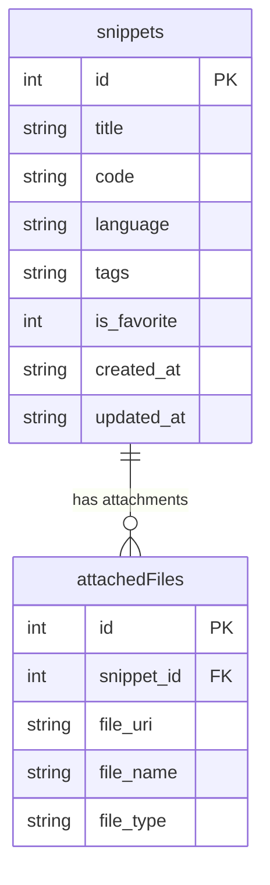

# DevSnippets

An offline-first, developer-centric mobile code snippet manager built using **Expo**, **React Native**, **SQLite**, and **TypeScript**. 

It allows you to capture code snippets on the fly, organize them with custom tags and favorites, preview them with syntactical highlighting, manage local developer templates, and export snippets to multiple formats — all working **100% offline**.

---

## Preview


---

## Key Features

- **Custom Monospace Code Viewer:** Features regex-based syntax token coloring (Dracula-inspired pink keywords, cyan built-ins, green strings, and gray comments) with dynamic line numbers and one-touch clipboard copying.
- **Gesture-Based Swipe Actions:** Swipe cards left to reveal the red **Delete** action (with confirmation alert), or swipe right to reveal the purple **Edit** action.
- **Offline-First Architecture:** Reads and writes operate on local SQLite database blocks synchronously or asynchronously without network dependencies.
- **Local File System Manager:** A folder browser to navigate internal documents folders, compute folder sizes recursively, copy/move files with auto-rename conflict resolution, share files natively, and download mock developer templates.
- **Multi-Format Snippet Export:** Export single snippets as plain text (`.txt`), JavaScript files (`.js`), or structured database backups (`.json`). Supports bulk database exports from Settings.
- **Customizable Preferences:** Toggle Dark Mode theme preference (stored via AsyncStorage) and scale the monospace editor font size dynamically (12px, 14px, or 16px).

---

## Database Architecture

The application runs an embedded **SQLite** instance (`devsnippets.db`) with foreign key constraints enabled.



### Table Schemas

```sql
CREATE TABLE snippets (
  id          INTEGER PRIMARY KEY AUTOINCREMENT,
  title       TEXT NOT NULL,
  code        TEXT NOT NULL,
  language    TEXT NOT NULL,
  tags        TEXT,
  is_favorite INTEGER DEFAULT 0,
  created_at  TEXT DEFAULT CURRENT_TIMESTAMP,
  updated_at  TEXT DEFAULT CURRENT_TIMESTAMP
);

CREATE TABLE attached_files (
  id          INTEGER PRIMARY KEY AUTOINCREMENT,
  snippet_id  INTEGER,
  file_uri    TEXT NOT NULL,
  file_name   TEXT,
  file_type   TEXT,
  FOREIGN KEY (snippet_id) REFERENCES snippets(id) ON DELETE CASCADE
);
```

---

## File System Structure

Files are organized within the application's local sandbox (`FileSystem.documentDirectory`):

- `documentDirectory/snippets/` — Directory housing screenshot files attached to individual snippets.
- `documentDirectory/templates/` — Downloaded code template files available for reuse.
- `documentDirectory/exports/` — Cached files generated during single or bulk exports.
- `documentDirectory/screenshots/` — Temp screenshots images directory.

---

## Getting Started

### Prerequisites

Ensure you have **Node.js** installed on your system.

### Run Instructions

1. Install the npm dependencies:
   ```bash
   npm install
   ```

2. Start the Expo development server:
   ```bash
   npx expo start
   ```

3. Scan the QR code using the **Expo Go** app on your physical iOS or Android device.
